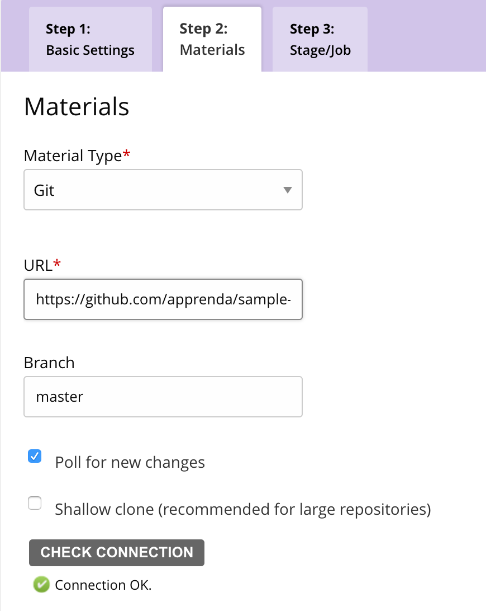
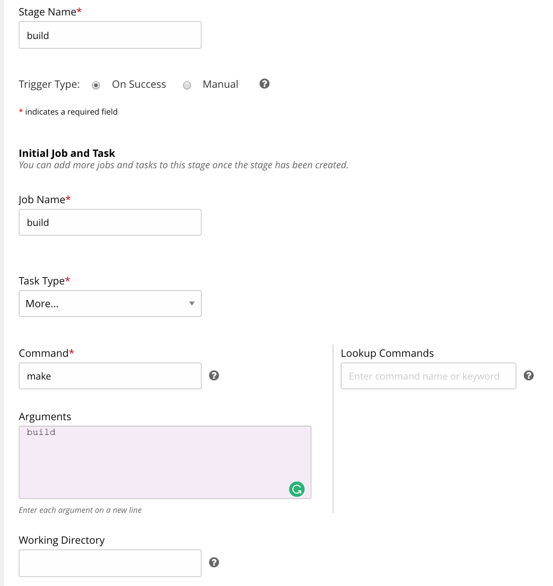
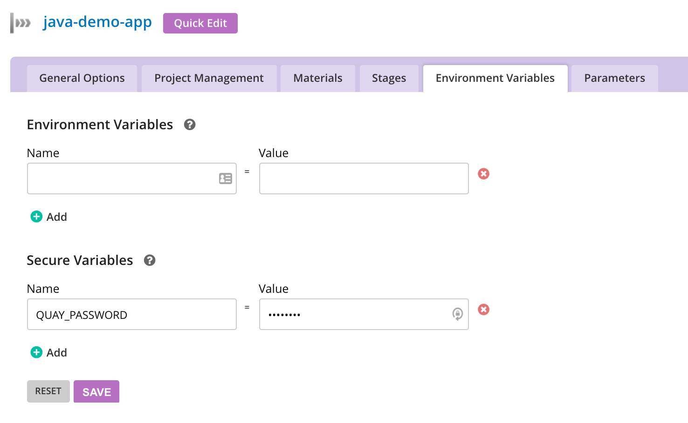
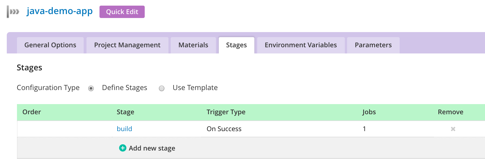
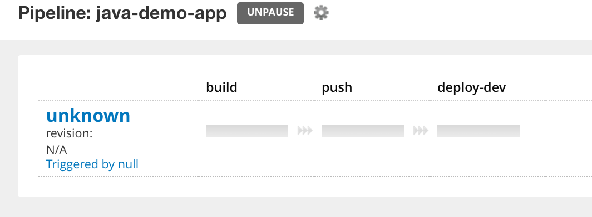

# Go.cd setup

## 1. Setting up the build material



## 2. Setting up the initial stage of the pipeline



## 3. Setting up the secured environment variable for the quay.io username and password.



## 4. Adding the push and deploy-to-dev stages of our pipeline (click add new stage)



- Stage Name: push
- Job Name: push
- Task Type: More ...
- Command: make (lowercase)
- Arguments: push (lowercase)

Repeat the above steps again but changing `push` for `deploy-dev`

## 5. Finalised pipeline



## Verification

Firstly we need to add the following to `/etc/hosts`

```
<ingress ip address> java-demo-app.example.com
```

Now browse to: <a href="http://java-demo-app.example.com/greeting">http://java-demo-app.example.com/greeting</a> you should be greeted with:

```
{"id":1,"content":"Hello, World!"}
```